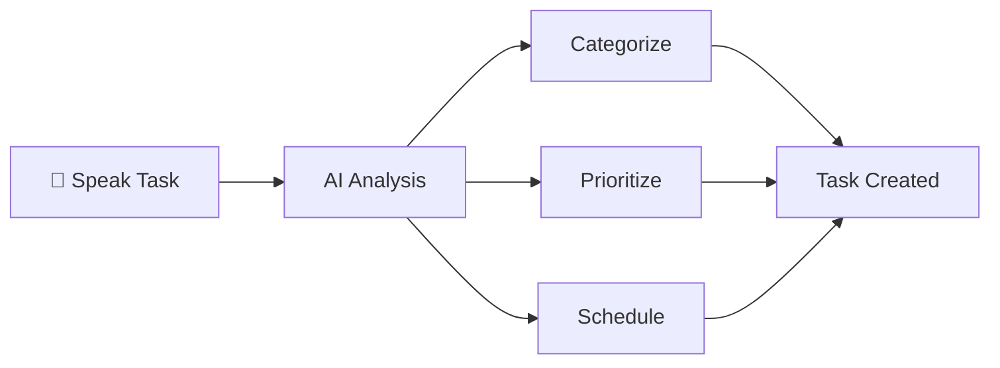

# 🎙️ VoiceTask - Voice-Powered Task Management

**Speak your tasks. We handle the rest.**

[ Live Demo](https://voice-task.vercel.app/voicetask-free-mvp.html) | [ Documentation](#features) | [ Report Bug](https://github.com/Zahra58/voicetask-demo/issues)

---

##  What is VoiceTask?

VoiceTask is a **voice-first task management app** that uses AI to automatically categorize, prioritize, and schedule your tasks. Just speak naturally - no forms, no typing, no hassle.

###  Key Features

-  **Voice Input** - Speak naturally, we understand
-  **Smart AI** - Auto-categorizes and prioritizes tasks
-  **Date Parsing** - "tomorrow at 2pm" → automatically scheduled
-  **Works Offline** - 100% client-side, no internet required
-  **Private** - Your data never leaves your device
-  **Instant** - No loading, no latency
-  **Beautiful UI** - Clean, modern design

---

##  Try It Now

** [Launch Live Demo](https://voice-task.vercel.app/voicetask-free-mvp.html)**

No installation, no signup, no credit card. Just click and start speaking!

### Quick Start

1. Click "Get Started"
2. Enter your name
3. Click the microphone button
4. Say: *"Team meeting tomorrow at 2pm"*
5. Watch the magic happen! 

---

##  Screenshots

### Voice Input

### Task Management

### Statistics

---

##  How It Works

**Example:**
- You say: *"Buy groceries tomorrow morning URGENT"*
- VoiceTask creates:
  - 📋 Title: "Buy groceries"
  - 🏷️ Category: Errands
  - ⚡ Priority: High
  - 📅 Due: Tomorrow 9:00 AM

---

## 🎤 Voice Commands

Try these natural phrases:

### Simple Tasks
- "Buy milk"
- "Call mom"
- "Finish report"

### With Dates
- "Team meeting tomorrow at 2pm"
- "Dentist appointment next Friday"
- "Project deadline in 3 days"

### With Priority
- "Email client URGENT"
- "Gym workout when possible"
- "Read book eventually"

### Complex Tasks
- "Schedule team standup every Monday morning"
- "Prepare presentation for Q4 review next week"
- "Book vacation flights by end of month ASAP"

---

##  Features

### 🎤 Voice Recognition
- Uses Web Speech API (built into browsers)
- Works in Chrome, Safari, Edge
- Supports multiple accents
- Real-time transcription

###  AI Categorization
Automatically detects:
- 💼 **Work**: meetings, projects, emails
- 🏠 **Personal**: family, hobbies, social
- 🏥 **Health**: doctor, gym, fitness
- 🛒 **Errands**: shopping, banking, chores

### ⚡ Priority Detection
- 🔴 **High**: urgent, ASAP, critical
- 🟡 **Medium**: should, need to (default)
- 🟢 **Low**: eventually, someday

### 📅 Date Parsing
- "today" → Sets to today
- "tomorrow" → Tomorrow
- "next week" → +7 days
- "Friday" → Next Friday
- "at 2pm" → Specific time
- "in 3 days" → Relative dates

###  Views
- **Today**: Focus on today's tasks
- **This Week**: Plan your week
- **All Tasks**: Complete overview

###  Statistics
- Total tasks created
- Completed vs pending
- Category breakdown
- Progress tracking

---

## 🛠️ Technology Stack

### Frontend
- **HTML5** - Structure
- **Tailwind CSS** - Styling
- **Vanilla JavaScript** - Logic
- **Web Speech API** - Voice recognition
- **LocalStorage** - Data persistence

### Features
- 100% client-side (no backend!)
- Works offline
- No dependencies (except CDN)
- Single file application
- ~50KB total size

---

##  Why VoiceTask?

### For Users
✅ **Fastest way to add tasks** - Just speak

✅ **No learning curve** - Natural language

✅ **Works anywhere** - Browser-based

✅ **Private & secure** - Local storage only

✅ **Free forever** - No subscription

### For Developers
✅ **Open source** - MIT License

✅ **Single file** - Easy to deploy

✅ **No backend** - Zero hosting costs

✅ **Modern code** - ES6+

✅ **Well documented** - Comments included

---

##  Roadmap

### ✅ Completed (Free Tier)
- [x] Voice recognition
- [x] AI categorization
- [x] Priority detection
- [x] Date parsing
- [x] Local storage
- [x] Responsive design
- [x] Offline support

###  Coming Soon (Pro Tier)
- [ ] Cloud sync across devices
- [ ] GPT-4 AI (95% accuracy vs 70%)
- [ ] Email reminders
- [ ] Calendar integration
- [ ] Team collaboration
- [ ] Mobile apps (iOS/Android)

###  Future Ideas
- [ ] Voice commands for task management
- [ ] Recurring tasks
- [ ] Subtasks & projects
- [ ] Tags & labels
- [ ] Time tracking
- [ ] Analytics & insights

---

##  Contributing

We welcome contributions! Here's how:

1.  Star this repository
2.  Report bugs via [Issues](https://github.com/Zahra58E/VoiceTask-demo/issues)
3.  Suggest features
4.  Improve documentation
5.  Submit pull requests (to private repo)

**Note:** Source code is in a private repository. This is a demo-only public repo.

---

##  License

This project is licensed under the MIT License - see the [LICENSE](LICENSE) file for details.

---

##  Acknowledgments

Inspired by the need for faster, more natural task management.

---

## 📞 Support

-  Email: support@voicetask.com
-  Twitter: [@VoiceTaskApp](https://twitter.com/voicetaskapp)
-  Discord: [Join our community](https://discord.gg/voicetask)

---

## ⭐ Show Your Support

If you like VoiceTask, please:
-  Star this repository
-  Share on Twitter
-  Write a blog post
-  Tell your friends

---

**Made with ❤️ and coffee by [Zahra Etebari](https://github.com/Zahra58)**

[ Try Demo](https://voice-task.vercel.app/voicetask-free-mvp.html) · [ Docs](#features) · [ Issues](https://github.com/Zahra58/VoiceTask-demo/issues)

